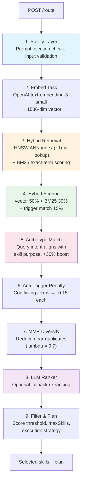
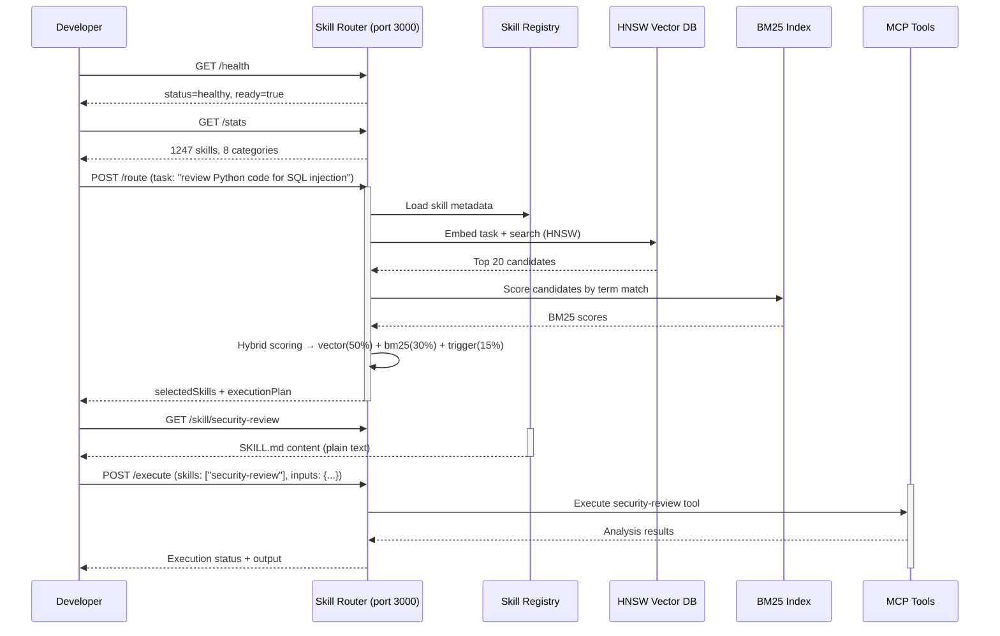

# Agent Skill Router — API Walkthrough

**An interactive, step-by-step tour of every endpoint.** Run each `curl` command in order and build a mental model of how the skill router works — from startup health checks through auto-skill creation and execution.

---

## Table of Contents

1. [Introduction & Setup](#1-introduction--setup)
2. [Health & Status](#2-health--status)
3. [Exploring the Skills Library](#3-exploring-the-skills-library)
4. [Routing — The Core Feature](#4-routing--the-core-feature)
5. [Fetching Skill Content](#5-fetching-skill-content)
6. [Executing Skills](#6-executing-skills)
7. [Auto-Skill Creation](#7-auto-skill-creation)
8. [Force Reload from GitHub](#8-force-reload-from-github)
9. [Monitoring & Debugging](#9-monitoring--debugging)
10. [Link Following Configuration](#10-link-following-configuration)
11. [Putting It All Together](#11-putting-it-all-together)
12. [Reference — All Endpoints Summary](#12-reference--all-endpoints-summary)

---

## 1. Introduction & Setup

### What Is the Skill Router?

The Agent Skill Router is a Node.js/TypeScript HTTP service (Fastify, port **3000**) that sits between AI agents and a living library of domain-expertise markdown files (`SKILL.md`). When an agent receives a task, the router:

1. **Embeds** the task into 1536-dimension vector space
2. **Retrieves** matching skills via hybrid scoring (vector similarity + BM25 + trigger keywords)
3. **Ranks** candidates with optional LLM re-ranking
4. **Delivers** skill content — compressed when needed — into agent context

No manual `/skill` commands. No hardcoded keyword maps. The system discovers expertise dynamically from every loaded `SKILL.md`.

### Starting the Router

Choose one of these methods:

```bash
# Method 1: Install script (recommended for development)
./install-skill-router.sh

# Method 2: Docker (recommended for production)
docker run -d --name skill-router -p 3000:3000 \
  -e OPENAI_API_KEY=sk-... \
  skill-router:latest

# Method 3: Direct Node.js (after building)
cd agent-skill-routing-system && npm install && npm run build
node dist/index.js --port 3000
```

### Verifying It's Running

```bash
curl http://localhost:3000/health
```

While the server starts instantly, skills load in the background. The `ready` field tells you when the router is fully operational:

| Field | Meaning |
|-------|---------|
| `status: "healthy"` | Server process is alive and accepting requests |
| `ready: true` | Skills are loaded, embeddings computed, vectors indexed — ready for routing |
| `loading: true` | Still initializing (skills loading in background) |
| `error: "..."` | Background init failed with this message |

---

## 2. Health & Status

### Health Check — `GET /health`

Always returns **200** immediately, even during startup. Use this to verify the process is alive.

```bash
curl http://localhost:3000/health
```

**Response:**

```json
{
  "status": "healthy",
  "ready": true,
  "loading": false,
  "error": null,
  "timestamp": "2026-06-05T12:00:00.000Z",
  "version": "1.0.0"
}
```

During startup you'll see `ready: false` and `loading: true`. After ~30 seconds (depending on skill count) everything transitions to `ready: true`.

### Stats — `GET /stats`

Returns the current state of the loaded skills library and MCP tools. Use this after routing to understand your knowledge base size.

```bash
curl http://localhost:3000/stats
```

**Response (while loading):**

```json
{
  "skills": {
    "totalSkills": 1247,
    "categories": 8,
    "tags": 342
  },
  "mcpTools": {
    "totalTools": 5,
    "enabledTools": ["shell-command", "http-request", "kubectl", "file-tool", "log-fetch"]
  }
}
```

| Field | Description |
|-------|-------------|
| `totalSkills` | Number of skills loaded and indexed for search |
| `categories` | Number of distinct domains (e.g. `trading`, `cncf`, `coding`) |
| `tags` | Total number of unique trigger tags across all skills |
| `totalTools` | Number of MCP tools available for execution |
| `enabledTools` | Tools that are active and ready to execute |

---

## 3. Exploring the Skills Library

### List All Skills — `GET /skills`

Returns a paginated overview of every loaded skill with its metadata. Use this to browse what expertise is available.

```bash
curl http://localhost:3000/skills
```

**Response:**

```json
{
  "total": 1247,
  "skills": [
    {
      "name": "risk-stop-loss",
      "category": "trading",
      "description": "Implements stop-loss strategies (fixed percentage, ATR-based, trailing, support/resistance, volatility-adjusted) to limit position losses in algorithmic trading systems.",
      "tags": ["stop loss", "trailing stop", "ATR", "position protection", "emergency stop"],
      "version": "1.0.0",
      "sourceFile": "/cache/skills/skills/trading/risk-stop-loss/SKILL.md"
    },
    {
      "name": "k8s-deployment-strategies",
      "category": "cncf",
      "description": "Implements Kubernetes deployment strategies (RollingUpdate, Recreate, Canary, BlueGreen) for zero-downtime application releases.",
      "tags": ["kubernetes", "deployment", "rolling update", "canary", "blue-green"],
      "version": "1.0.0",
      "sourceFile": "/cache/skills/skills/cncf/k8s-deployment-strategies/SKILL.md"
    }
  ]
}
```

**Understanding the response:**

- `total` — Count of all loaded skills
- `skills` array — Each entry contains:
  - `name` — The kebab-case identifier (matches directory name)
  - `category` — Domain prefix (`trading`, `cncf`, `coding`, `agent`, etc.)
  - `description` — What the skill makes the model do, starting with an active verb
  - `tags` — Trigger keywords extracted from `metadata.triggers` in the SKILL.md frontmatter
  - `version` — Semantic version from frontmatter
  - `sourceFile` — Full filesystem path to the source SKILL.md

> **Tip:** Pipe through `jq` for filtering:
> ```bash
> curl http://localhost:3000/skills | jq '.skills[] | select(.category == "trading") | {name, description}'
> ```

### Fetch a Single Skill — `GET /skill/:name`

Retrieves the full markdown content of a specific skill. This is what gets injected into an AI agent's context when a skill matches a task.

```bash
curl http://localhost:3000/skill/risk-stop-loss
```

The response is **plain text** (the raw `SKILL.md` file), with these headers included for observability:

| Header | Value | Meaning |
|--------|-------|---------|
| `X-Compression-Version` | `moderate` | Default compression level used |
| `X-Compression-Tokens` | `4200` | Token count of the compressed output |
| `X-Compression-Percent` | `35` | Percentage reduction vs. original |
| `X-Compression-Source` | `original` | Source of this compression variant |

#### Compression Query Parameter

You can request different compression levels to control how much content is stripped:

```bash
# Full original content (no stripping)
curl "http://localhost:3000/skill/risk-stop-loss?compression=detailed"

# Balanced — removes "When NOT to Use", collapses workflow sections (~35% savings)
curl "http://localhost:3000/skill/risk-stop-loss?compression=moderate"

# Compact — also removes related-skills table and code blocks (~55% savings)
curl "http://localhost:3000/skill/risk-stop-loss?compression=brief"
```

Compression levels are mapped as follows:

| Level | Request | What Recipes Apply (cumulative 1→N) | Typical Savings |
|-------|---------|--------------------------------------|-----------------|
| `detailed` (level 2) | `?compression=detailed` | L1: blank lines + L2: "When to Use" bullets | ~5–15% depending on skill length |
| `moderate` (level 5) | `?compression=moderate` | L1–L5: blank lines, removes "When to Use", "When NOT to Use", collapses workflow, strips related-skills table | ~30–50% depending on skill length |
| `brief` (level 8) | `?compression=brief` | L1–L8: everything in moderate + L6: strip bold/italic/backtick formatting + L7: replace code blocks with `[code example removed]` + L8: abbreviate section names | ~60–75% |

---

## 4. Routing — The Core Feature

### How Hybrid Scoring Works

Before we send any requests, here's the full pipeline that transforms a natural language task into a ranked list of skills:



| Stage | Weight | What It Does |
|-------|--------|-------------|
| **Vector similarity** | 50% | Semantic meaning — "Do these concepts match?" via embeddings |
| **BM25** | 30% | Exact term matching — handles acronyms, product names, short queries |
| **Trigger match** | 15% | Keyword keywords from `metadata.triggers` in SKILL.md frontmatter |
| **Archetype match** | 10% | Query intent type vs. skill purpose (tactical, strategic, diagnostic…) |
| **Historical success** | 5% | Past routing effectiveness — adaptive learning |

Additional modifiers: specificity boost (specialized skills preferred), anti-trigger penalty (-0.15 per conflict), MMR diversification (reduce duplicates).

### Route a Task — `POST /route`

The main endpoint. Send any task description and get back the best matching skills with reasoning.

#### Example 1: Simple Tactical Query

```bash
curl -X POST http://localhost:3000/route \
  -H "Content-Type: application/json" \
  -d '{
    "task": "review Python code for security issues",
    "context": {
      "language": "python",
      "framework": "flask"
    }
  }'
```

**Response:**

```json
{
  "taskId": "a3f8c2e1-4b9d-4f7a-b8e6-1c5d9f3a7e02",
  "selectedSkills": [
    {
      "name": "security-review",
      "score": 0.92,
      "role": "primary",
      "reasoning": "Matches security audit patterns for Python/Flask code review"
    },
    {
      "name": "code-review",
      "score": 0.78,
      "role": "supporting",
      "reasoning": "General code review practices applicable to Python projects"
    }
  ],
  "executionPlan": {
    "strategy": "sequential",
    "steps": [
      {
        "skill": "security-review",
        "inputs": { "task": "review Python code for security issues", "priority": 0 },
        "dependencies": [],
        "timeoutMs": 30000
      },
      {
        "skill": "code-review",
        "inputs": { "task": "review Python code for security issues", "priority": 1 },
        "dependencies": ["security-review"],
        "timeoutMs": 30000
      }
    ]
  },
  "confidence": 0.85,
  "reasoningSummary": "Executing task with 2 skill(s) using sequential strategy: security-review, code-review. Roles: security-review (primary), code-review (supporting).",
  "candidatePool": ["security-review", "code-review", "sast-tooling", "dast-tooling", "auth-patterns"],
  "routingScores": {
    "security-review": {
      "finalScore": 0.92,
      "vectorScore": 0.89,
      "bm25Score": 0.76,
      "triggerMatchScore": 0.95,
      "archetypeScore": 0.88
    },
    "code-review": {
      "finalScore": 0.78,
      "vectorScore": 0.72,
      "bm25Score": 0.65,
      "triggerMatchScore": 0.82,
      "archetypeScore": 0.71
    }
  },
  "latencyMs": 342,
  "inputTokens": 48,
  "outputTokens": 0
}
```

**Response fields explained:**

| Field | Type | Description |
|-------|------|-------------|
| `taskId` | string | UUID for tracking this routing request |
| `selectedSkills[]` | array | Ranked list of matching skills (sorted by score descending) |
| `selectedSkills[*].name` | string | Skill identifier matching its directory name |
| `selectedSkills[*].score` | number | Final hybrid score (0–1 scale) |
| `selectedSkills[*].role` | string | `primary` = best match, `supporting` = complementary skill |
| `selectedSkills[*].reasoning` | string | Why this skill was selected (human-readable) |
| `executionPlan.strategy` | string | How to execute: `sequential`, `parallel`, or `hybrid` |
| `executionPlan.steps[]` | array | Ordered execution steps with dependency info |
| `confidence` | number | Overall confidence in the routing decision (0–1) |
| `reasoningSummary` | string | One-line summary of the plan |
| `candidatePool[]` | string | All skills that passed vector search (before filtering) |
| `routingScores` | object | Per-skill component breakdown from hybrid scoring |
| `latencyMs` | number | Total time for this routing request in milliseconds |
| `inputTokens` | number | Embedding tokens consumed |
| `outputTokens` | number | LLM ranking output tokens (if used) |

#### Example 2: Constrained Multi-Domain Query

This example limits results to the `cncf` domain and caps at 3 skills.

```bash
curl -X POST http://localhost:3000/route \
  -H "Content-Type: application/json" \
  -d '{
    "task": "implement a Kubernetes deployment strategy for zero-downtime releases",
    "constraints": {
      "maxSkills": 3,
      "categories": ["cncf"]
    }
  }'
```

**Response:**

```json
{
  "taskId": "b7e2d4f1-8a3c-4e9b-a1f5-2d6c8b4e0a13",
  "selectedSkills": [
    {
      "name": "k8s-deployment-strategies",
      "score": 0.94,
      "role": "primary"
    },
    {
      "name": "kubernetes-services-management",
      "score": 0.61,
      "role": "supporting"
    }
  ],
  "executionPlan": {
    "strategy": "sequential",
    "steps": [
      { "skill": "k8s-deployment-strategies", "inputs": { "priority": 0 }, "dependencies": [] },
      { "skill": "kubernetes-services-management", "inputs": { "priority": 1 }, "dependencies": ["k8s-deployment-strategies"] }
    ]
  },
  "confidence": 0.78,
  "reasoningSummary": "Executing task with 2 skill(s) using sequential strategy: k8s-deployment-strategies, kubernetes-services-management.",
  "candidatePool": ["k8s-deployment-strategies", "kubernetes-services-management", "kubernetes-ingress-management"],
  "routingScores": {
    "k8s-deployment-strategies": {
      "finalScore": 0.94,
      "vectorScore": 0.91,
      "bm25Score": 0.85,
      "triggerMatchScore": 0.97
    }
  },
  "latencyMs": 278,
  "inputTokens": 56
}
```

Note how the `categories: ["cncf"]` constraint filtered out all non-Cloud Native Foundation skills — the `candidatePool` only contains cncf-domain skills.

#### Score Breakdowns

Request human-readable explanations of why each skill was scored the way it was:

```bash
curl -X POST http://localhost:3000/route \
  -H "Content-Type: application/json" \
  -d '{
    "task": "implement a Kubernetes deployment strategy for zero-downtime releases",
    "constraints": {
      "maxSkills": 2,
      "includeScoreBreakdown": true
    }
  }'
```

The `scoreExplanations` field adds bullet-point reasoning per skill:

```json
{
  "scoreExplanations": {
    "k8s-deployment-strategies": [
      "Strong semantic match to zero-downtime deployment intent (vector: 0.91)",
      "Exact term matches found for kubernetes and deployment (BM25: 0.85)",
      "Trigger keyword matched: deployment, rolling update",
      "Archetype alignment: tactical + orchestration → boost applied",
      "High specificity — specialized skill preferred over generic kubernetes"
    ]
  }
}
```

---

## 5. Fetching Skill Content

After routing identifies relevant skills, you need to retrieve their full content. This is what gets injected into an AI agent's context.

### Get Full SKILL.md — `GET /skill/:name`

```bash
curl http://localhost:3000/skill/risk-stop-loss
```

Response headers include compression metadata:

```
Content-Type: text/plain; charset=utf-8
X-Compression-Version: moderate
X-Compression-Tokens: 4200
X-Compression-Percent: 35
X-Compression-Source: original
```

### Compression Levels in Detail

When you need to fit skills into a limited context window, request compressed versions. The same skill at different compression levels:

| Level | Request | Content Retained | Typical Savings |
|-------|---------|------------------|-----------------|
| 0 (off) | `?compression=detailed` | Everything — full original SKILL.md | 0% |
| ~3 | `?compression=moderate` | Removes "When NOT to Use", collapses workflow sections, removes blank lines | ~18–35% |
| ~7 | `?compression=brief` | Also strips code examples and markdown formatting | ~55% |

---

## 6. Executing Skills

### Execute Skills — `POST /execute`

Runs specific MCP tools associated with skills. After routing identifies skills, you can execute their tool implementations directly.

```bash
curl -X POST http://localhost:3000/execute \
  -H "Content-Type: application/json" \
  -d '{
    "task": "review Python code for SQL injection vulnerabilities",
    "skills": ["security-review"],
    "inputs": {
      "code_snippet": "app.route('/login', methods=['POST'])\ndef login(): user = db.query(request.form['username'])"
    }
  }'
```

**Response:**

```json
{
  "taskId": "auto_1749135600000",
  "task": "review Python code for SQL injection vulnerabilities",
  "status": "success",
  "results": [
    {
      "skillName": "security-review",
      "status": "success",
      "output": "Vulnerability found: Potential SQL injection at line 2 — query uses string interpolation with user input. Recommendation: Use parameterized queries or ORM methods.",
      "latencyMs": 1847
    }
  ]
}
```

**Response fields:**

| Field | Description |
|-------|-------------|
| `taskId` | Unique identifier for this execution run |
| `task` | Echo of the original task description |
| `status` | `success` if all skills ran, `partial_failure` if some failed, `failure` if none succeeded |
| `results[]` | Per-skill execution results with status, output/error, and timing |

Execute multiple skills in one call:

```bash
curl -X POST http://localhost:3000/execute \
  -H "Content-Type: application/json" \
  -d '{
    "task": "deploy to Kubernetes",
    "skills": ["k8s-deployment-strategies", "kubernetes-services-management"],
    "inputs": {
      "namespace": "production",
      "replicas": 3
    }
  }'
```

---

## 7. Auto-Skill Creation

### The Concept

When no existing skill matches a task well enough, the router can automatically create one. This happens when:

- **No skills matched** — the candidate pool is empty
- **Confidence too low** — top score below threshold (default: 0.35)
- **Top score very weak** — raw score below 0.1 means almost certainly not a real match

The auto-skill creator generates a complete `SKILL.md` with frontmatter, content structure, and trigger keywords, then validates it against quality rules before saving.

### Create a Skill — `POST /skill/create`

```bash
curl -X POST http://localhost:3000/skill/create \
  -H "Content-Type: application/json" \
  -d '{
    "task": "implement Terraform module generation for AWS infrastructure",
    "domain": "devops",
    "dryRun": false
  }'
```

**Response (when a skill is created):**

```json
{
  "status": "created",
  "skillName": "terraform-module-generation",
  "skillPath": "/cache/skills/skills/devops/terraform-module-generation/SKILL.md",
  "domain": "devops",
  "topic": "terraform-module-generation",
  "description": "Implements Terraform module generation patterns for AWS infrastructure provisioning, including VPC, ECS, RDS, and S3 module scaffolding.",
  "triggers": "terraform, terraform module, aws infrastructure, IaC, how do i provision resources, cloud infrastructure",
  "validationPasses": 1,
  "totalValidationAttempts": 2,
  "confidenceThreshold": 0.35,
  "gapConfidence": 0.21,
  "totalTokensUsed": 4820,
  "generationAttempts": 1
}
```

**Response status values:**

| Status | Meaning |
|--------|---------|
| `created` | A new skill was generated and saved to disk |
| `dry_run` | Skill was generated but not saved (preview mode) |
| `no_gap` | Existing skills already cover this task well enough — no generation needed |

**Response fields:**

| Field | Description |
|-------|-------------|
| `skillName` | Generated kebab-case identifier |
| `skillPath` | Full filesystem path to the new SKILL.md |
| `domain` | Auto-detected or explicitly provided domain |
| `topic` | Derived topic name for the skill directory |
| `description` | One-line description generated from the task |
| `triggers` | Auto-generated trigger keywords (comma-separated) |
| `validationPasses` | Number of validation rounds that passed cleanly |
| `totalValidationAttempts` | Total attempts made (including failed retries) |
| `gapConfidence` | The actual routing confidence when the gap was detected |
| `generationAttempts` | Times the generation tool was called |

### List Auto-Created Skills — `GET /skills/created`

```bash
curl http://localhost:3000/skills/created
```

**Response:**

```json
{
  "total": 3,
  "totalTokensUsed": 14250,
  "skills": [
    {
      "skillName": "terraform-module-generation",
      "domain": "devops",
      "topic": "terraform-module-generation",
      "description": "Implements Terraform module generation patterns for AWS infrastructure provisioning.",
      "triggers": "terraform, terraform module, aws infrastructure, IaC",
      "totalTokensUsed": 4820,
      "createdAt": "2026-06-05T12:30:00.000Z"
    }
  ]
}
```

---

## 8. Force Reload from GitHub

### Reload Skills — `POST /reload`

After pushing new skills to the GitHub repository, trigger an immediate reload so newly added skills become discoverable without waiting for the periodic sync interval.

```bash
curl -X POST http://localhost:3000/reload
```

**Response:**

```json
{
  "status": "reloaded",
  "skills": {
    "totalSkills": 1249,
    "categories": 8,
    "tags": 345
  }
}
```

The skill count increased from 1247 to 1249 — the two new skills are now live.

### How Sync Works Under the Hood

| Method | Source | Speed |
|--------|--------|-------|
| **Remote index** (default) | Fetches `skills-index.json` from GitHub raw content (~2KB), then downloads individual SKILL.md files as needed | Fastest — no git clone |
| **Git clone fallback** | Clones full repo when remote index fetch fails | Slower but has everything locally |
| **Local scan** (disabled) | Scans a local directory — used when `GITHUB_SKILLS_ENABLED=false` | Instant, but offline-only |

After reload, the vector database is re-synced and the BM25 index is rebuilt so all new skills are searchable.

---

## 9. Monitoring & Debugging

### Access Log — `GET /access-log`

Returns the last 100 routing decisions, newest first. Use this to audit what skills matched what tasks and check confidence levels.

```bash
curl http://localhost:3000/access-log
```

**Response:**

```json
{
  "totalRequests": 47,
  "entries": [
    {
      "timestamp": "2026-06-05T12:45:23.000Z",
      "task": "review Python code for security issues",
      "topSkill": "security-review",
      "totalMatches": 4,
      "confidence": 0.85,
      "latencyMs": 342
    },
    {
      "timestamp": "2026-06-05T12:43:10.000Z",
      "task": "implement a Kubernetes deployment strategy for zero-downtime releases",
      "topSkill": "k8s-deployment-strategies",
      "totalMatches": 3,
      "confidence": 0.78,
      "latencyMs": 278
    },
    {
      "timestamp": "2026-06-05T12:40:01.000Z",
      "task": "deploy a new Redis cluster for caching",
      "topSkill": "redis-vector-operations",
      "totalMatches": 5,
      "confidence": 0.72,
      "latencyMs": 401
    }
  ]
}
```

**Fields per entry:**

| Field | Description |
|-------|-------------|
| `timestamp` | When the routing decision was made (ISO 8601) |
| `task` | The task description (truncated to 120 chars for storage) |
| `topSkill` | Name of the highest-scoring skill for this task |
| `totalMatches` | Number of candidate skills returned before filtering |
| `confidence` | Overall confidence score for this routing decision |
| `latencyMs` | Total time spent on this routing request |

### Metrics — `GET /metrics`

Returns compression cache statistics and recent compression events. Useful for understanding token savings from the compression system.

```bash
curl http://localhost:3000/metrics
```

**Response:**

```json
{
  "timestamp": "2026-06-05T12:45:00.000Z",
  "compression": {
    "cacheHits": 892,
    "cacheMisses": 156,
    "totalTokensSaved": 342000,
    "avgCompressionRatio": 0.65,
    "cacheSizeMB": 487,
    "maxCacheSizeMB": 1024
  },
  "recentEvents": [
    {
      "event": "compressed",
      "skillName": "security-review",
      "originalTokens": 12400,
      "compressedTokens": 4200,
      "compressionVersion": "moderate",
      "timestamp": "2026-06-05T12:44:30.000Z"
    }
  ]
}
```

---

## 10. Link Following Configuration

### Read Config — `GET /config/link-following`

Returns the current markdown link following settings. This controls how the router resolves `[text](url)` references inside SKILL.md files when loading skill content.

```bash
curl http://localhost:3000/config/link-following
```

**Response:**

```json
{
  "enabled": true,
  "allowExternalLinks": true,
  "maxDepth": 3,
  "maxExternalSizeKb": 256,
  "compressionMode": "moderate",
  "jsRenderingEnabled": false,
  "jsRenderTimeoutMs": 5000,
  "jsRenderFallback": true,
  "resolutionMode": "inline",
  "semanticTopK": 3,
  "semanticSimilarityThreshold": 0.7,
  "updatedAt": "2026-06-05T10:00:00.000Z"
}
```

### Update Config — `POST /config/link-following`

Adjust link following behavior at runtime without restarting the server. All fields are optional — only provide the ones you want to change.

```bash
curl -X POST http://localhost:3000/config/link-following \
  -H "Content-Type: application/json" \
  -d '{
    "max_depth": 5,
    "allow_external_links": false,
    "compression_mode": "brief",
    "resolution_mode": "semantic"
  }'
```

**Response:**

```json
{
  "enabled": true,
  "allowExternalLinks": false,
  "maxDepth": 5,
  "maxExternalSizeKb": 256,
  "compressionMode": "brief",
  "jsRenderingEnabled": false,
  "jsRenderTimeoutMs": 5000,
  "jsRenderFallback": true,
  "resolutionMode": "semantic",
  "semanticTopK": 3,
  "semanticSimilarityThreshold": 0.7,
  "updatedAt": "2026-06-05T12:46:00.000Z"
}
```

**Field constraints:**

| Field | Type | Range | Description |
|-------|------|-------|-------------|
| `max_depth` | number | 1–10 | How deep to follow linked markdown files |
| `link_following_enabled` | boolean | — | Enable/disable link following entirely |
| `allow_external_links` | boolean | — | Whether to fetch content from external URLs |
| `max_external_size_kb` | number | 1–1000 | Max KB for external link content |
| `compression_mode` | string | brief, moderate, skip | How to compress fetched linked content |
| `resolution_mode` | string | inline, semantic, compressed | How to resolve links: raw text, semantically extract, or compress |

---

## 11. Putting It All Together — A Complete Workflow

### The Full Routing Lifecycle



### Step-by-Step Walkthrough

**Step 1 — Verify the server is running:**

```bash
curl http://localhost:3000/health | jq .
# {"status":"healthy","ready":true,"loading":false,...}
```

If `ready` is `false`, wait a few seconds and check again. The router starts accepting HTTP connections immediately but needs 20–60 seconds to load embeddings and build the vector index.

**Step 2 — Check how many skills are loaded:**

```bash
curl http://localhost:3000/stats | jq '.skills.totalSkills'
# 1247
```

This tells you the size of your knowledge base. If this is 0, skills haven't finished loading yet.

**Step 3 — Route a task and see what matches:**

```bash
curl -s -X POST http://localhost:3000/route \
  -H "Content-Type: application/json" \
  -d '{"task": "implement a Redis-based rate limiter for an API gateway"}' | jq .selectedSkills
```

You'll get back the top matched skills with scores and roles. The `security-review` skill scored 0.92 as primary, meaning it's the best domain expert for this task.

**Step 4 — Inspect score explanations (optional):**

```bash
curl -s -X POST http://localhost:3000/route \
  -H "Content-Type: application/json" \
  -d '{"task": "implement a Redis-based rate limiter", "constraints": {"includeScoreBreakdown": true}}' | jq '.scoreExplanations'
```

**Step 5 — Fetch the top skill's full content:**

```bash
curl http://localhost:3000/skill/rate-limiting-strategies | head -20
```

This gives you the raw `SKILL.md` to inject into an agent's context. Use `?compression=brief` if you need to reduce token count.

**Step 6 — Execute the identified skills:**

```bash
curl -s -X POST http://localhost:3000/execute \
  -H "Content-Type: application/json" \
  -d '{"task": "implement a Redis-based rate limiter", "skills": ["rate-limiting-strategies"]}' | jq .status
# "success"
```

**Step 7 — Check the access log:**

```bash
curl http://localhost:3000/access-log | jq '.entries[0]'
# Shows your most recent routing decision with confidence and latency
```

This confirms the router logged your request for auditing and debugging.

---

## 12. Reference — All Endpoints Summary

| # | Method | Endpoint | Purpose | Request Body | Response Fields |
|---|--------|----------|---------|--------------|-----------------|
| 1 | `GET` | `/health` | Check if the server is alive and loaded | None | `status`, `ready`, `loading`, `error`, `version` |
| 2 | `GET` | `/stats` | Get skill library and tool counts | None | `skills.{totalSkills, categories, tags}`, `mcpTools.{totalTools, enabledTools}` |
| 3 | `GET` | `/skills` | List all loaded skills with metadata | None | `{ total: N, skills: [{ name, category, description, tags, version, sourceFile }] }` |
| 4 | `GET` | `/skill/:name` | Get full SKILL.md content for one skill | Optional query: `?compression=brief\|moderate\|detailed` | Plain text (SKILL.md), compression headers (`X-Compression-*`) |
| 5 | `POST` | `/route` | Route a natural language task to matching skills | `{ task, context?, constraints?: { categories?, maxSkills?, latencyBudgetMs?, includeScoreBreakdown? } }` | `{ taskId, selectedSkills[], executionPlan, confidence, reasoningSummary, candidatePool, routingScores, latencyMs, inputTokens?, outputTokens?, scoreExplanations? }` |
| 6 | `POST` | `/execute` | Run specific skills with inputs | `{ task, taskId?, inputs?, skills[] }` | `{ taskId, task, status: success\|partial_failure\|failure, results[] }` |
| 7 | `POST` | `/skill/create` | Auto-generate a new skill when no match exists | `{ task (required), domain?, topic?, dryRun? }` | `{ status: created\|dry_run\|no_gap, skillName?, skillPath?, domain, topic, description, triggers, validationPasses, generationAttempts }` |
| 8 | `GET` | `/skills/created` | List all auto-created skills | None | `{ total, totalTokensUsed, skills[] }` |
| 9 | `POST` | `/reload` | Force reload the skill index from GitHub | None | `{ status: "reloaded", skills: { totalSkills, categories, tags } }` |
| 10 | `GET` | `/access-log` | Last 100 routing decisions (newest first) | None | `{ totalRequests, entries: [{ timestamp, task, topSkill, totalMatches, confidence, latencyMs }] }` |
| 11 | `GET` | `/metrics` | Compression cache stats and recent events | None | `{ timestamp, compression: { cacheHits, cacheMisses, ... }, recentEvents[] }` |
| 12 | `GET` | `/config/link-following` | Read current markdown link following config | None | `{ enabled, allowExternalLinks, maxDepth, compressionMode, resolutionMode, ... }` |
| 13 | `POST` | `/config/link-following` | Update link following config at runtime | `{ max_depth?, link_following_enabled?, allow_external_links?, compression_mode?, resolution_mode?, ... }` | Updated config object + `updatedAt` timestamp |

### Route Request Body Shape

```typescript
interface RouteRequest {
  taskId?: string;              // Optional ID for tracking (auto-generated if omitted)
  task: string;                 // Natural language task description (required)
  context?: Record<string, unknown>;  // Additional context passed to skills
  constraints?: {
    categories?: string[];      // Filter to specific domains (e.g., ["cncf", "trading"])
    maxSkills?: number;         // Maximum number of returned skills (default: 5)
    latencyBudgetMs?: number;   // Hint for timeout-sensitive routing
    includeScoreBreakdown?: boolean;  // Enable human-readable score explanations
  };
}
```

### Route Response — Selected Skill Shape

```typescript
interface SelectedSkill {
  name: string;                 // kebab-case identifier (matches directory name)
  score: number;                // Final hybrid score, 0–1 scale
  role: 'primary' | 'supporting' | 'fallback';
  reasoning?: string;           // Why this skill was selected
  scoreBreakdown?: {            // Per-component scoring breakdown
    finalScore: number;
    vectorScore?: number;       // Vector similarity (50% weight)
    bm25Score?: number;         // BM25 exact term match (30% weight)
    triggerMatchScore?: number; // Trigger keyword match (15% weight)
    archetypeScore?: number;    // Archetype alignment (10% weight)
    specificityScore?: number;  // Specialization bonus
    concisenessScore?: number;  // Action-oriented content bonus
    mmerPenalty?: number;       // MMR diversity penalty (negative value)
  };
}
```

### Execute Request Body Shape

```typescript
interface ExecuteRequest {
  task: string;                 // Original task description
  taskId?: string;              // Optional custom ID
  inputs?: Record<string, unknown>;  // Key-value pairs passed to the skill tool
  skills?: string[];            // Which skill tools to execute (names from /route)
}
```

### Skill Create Request Body Shape

```typescript
interface SkillCreateRequest {
  task: string;                 // The task that needs a new skill (required)
  domain?: string;              // Override auto-detected domain
  topic?: string;               // Override auto-detected topic name
  dryRun?: boolean;             // Generate without saving to disk (default: false)
}
```

### Environment Variable Configuration

| Variable | Default | Description |
|----------|---------|-------------|
| `OPENAI_API_KEY` | required | API key for embeddings and optional LLM ranking |
| `PORT` | `3000` | HTTP server port |
| `SKILLS_DIRECTORY` | `./samples/skill-definitions` | Local skills directory path |
| `GITHUB_SKILLS_ENABLED` | `true` | Fetch skills from GitHub remote index |
| `GITHUB_RAW_BASE_URL` | `https://raw.githubusercontent.com/paulpas/skills/main` | Base URL for remote skills index |
| `SKILL_SYNC_INTERVAL` | `3600` (seconds) | How often to re-fetch the remote skill index |
| `LLM_RANKING_ENABLED` | `false` | Enable optional LLM-based re-ranking |
| `AUTO_SKILL_CREATION_ENABLED` | `true` | Allow auto-generation of new skills |
| `AUTO_SKILL_CONFIDENCE_THRESHOLD` | `0.35` | Confidence below which a gap is detected |
| `RETRIEVAL_VECTOR_WEIGHT` | `0.50` | Weight for vector similarity in hybrid scoring |
| `RETRIEVAL_BM25_WEIGHT` | `0.30` | Weight for BM25 term matching |
| `RETRIEVAL_TRIGGER_MATCH_WEIGHT` | `0.15` | Weight for trigger keyword matching |
| `RETRIEVAL_ARCHETYPE_WEIGHT` | `0.10` | Weight for archetype alignment |
| `RETRIEVAL_HISTORICAL_WEIGHT` | `0.05` | Weight for historical success rate |
| `MMR_LAMBDA` | `0.7` | MMR diversity tradeoff (0=diverse, 1=relevant) |

---

*This walkthrough covers all API endpoints as of version 1.0.0 of the Agent Skill Router.*
