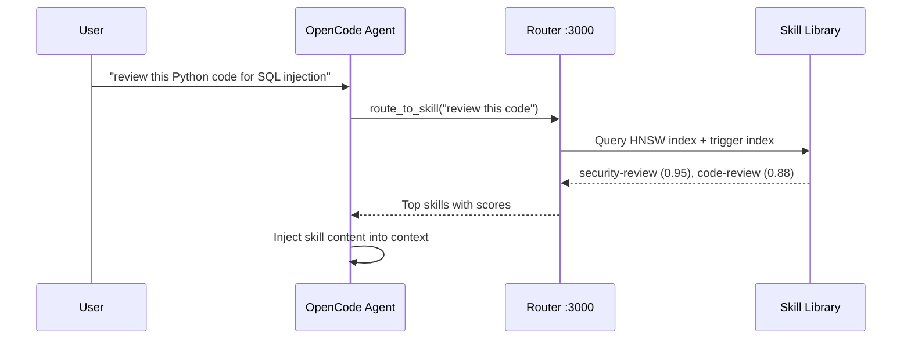

# Skill Router — Show and Tell

**Just-in-time AI expertise, routed automatically.**

The Agent Skill Router matches user tasks to specialized `SKILL.md` documents via hybrid semantic + keyword search. 1,236 skills across 24 domains — loaded only when needed, compressed when heavy, auto-generated when missing.



---

## Table of Contents

**◈ OVERVIEW** — What it is, why it exists, the routing pipeline
**◈ SKILL SYSTEM** — Format, domains, triggers, auto-generation
**◈ ROUTING ENGINE** — Hybrid search, HNSW, LLM ranking, safety
**◈ NEW FEATURES** — Auto-skill creation, token tracking, dynamic indexing, 3-phase validation
**◈ DEEP DIVES** — Compression, link following, embeddings resilience
**◈ REFERENCE** — API, Docker, configuration

---

## What Is This Thing?

TypeScript/Node.js HTTP service (Fastify, port 3000) that sits between AI agents and a living library of domain-expertise markdown files. When an agent receives a task, the router:

1. **Embeds** the task into 1536-dim vector space
2. **Retrieves** matching skills via hybrid scoring (vector + BM25 + triggers)
3. **Ranks** candidates with optional LLM re-ranking
4. **Delivers** skill content into agent context — compressed if needed

No manual `/skill` commands. No hardcoded keyword maps. The trigger→domain index is built dynamically from `metadata.triggers` in every loaded `SKILL.md`.

**Architecture:** Node.js 24 / Alpine Linux (~757MB Docker). Embeddings: OpenAI `text-embedding-3-small` (1536d) with LLM-emulation and deterministic-hash fallbacks. HNSW graph for ~1ms ANN search.

---

## The Routing Pipeline

Six stages, each feeding the next:


| # | Stage | Timing | Key Details |
|---|-------|--------|-------------|
| 1 | **Safety Layer** | ~0.1ms | Prompt injection (regex Tier 1), task length, skill allowlist, input sanitization |
| 2 | **Hybrid Retrieval** | ~200ms | Vector similarity 50% + BM25 20% — HNSW ANN returns top candidates in ~1ms |
| 3 | **Archetype+Trigger** | ~0.1ms | Trigger keywords 15% (from dynamic trigger→domain index), archetype alignment 10%, anti-trigger penalties |
| 4 | **MMR Diversify** | ~0.1ms | Reduces near-duplicates via MMR (lambda=0.7) |
| 5 | **LLM Ranker** | ~3s optional | Re-ranks by semantic nuance when `LLM_RANKING_ENABLED=true`; brace-counting JSON extraction for reasoning models |
| 6 | **Filter+Plan** | ~0.1ms | Score ≥ 0.5 threshold, maxSkills cap, execution strategy: sequential / parallel / hybrid |

### Why It Works

Raw LLMs are generalists — they know a little about everything but aren't domain experts. The router provides **just-in-time expertise**: skills loaded only when triggered, compressed to fit context windows, auto-generated when no existing skill matches the task.

---

## Skills: The Knowledge Base

1,236 `SKILL.md` files across 24 domains — each a self-contained expertise document with YAML frontmatter and structured markdown body.


### SKILL.md Anatomy

```yaml
---
name: risk-stop-loss            # Must match directory name (kebab-case)
description: >                  # Active verb + domain context, ~200 chars max
  Implements stop-loss strategies
  for algorithmic trading systems
license: MIT
compatibility: opencode
metadata:
  version: "1.0.0"
  domain: trading               # Maps to skills/ directory
  role: implementation          # implementation | reference | orchestration | review
  scope: implementation         # implementation | infrastructure | orchestration | review
  output-format: code           # code | manifests | analysis | report
  triggers: stop loss, trailing stop,     # Drives auto-loading (5-8 terms)
    ATR stop, position protection,
    emergency stop, stop-loss
  related-skills: trading-risk-position-sizing, trading-risk-kill-switches
---
```

Content body follows a strict structure: H1 title, role description, TL;DR checklist, when to use / when not to use, core workflow (numbered steps with domain-specific actions), constraints (MUST DO / MUST NOT DO), code examples, related skills table. **Zero tolerance for stubs** — minimum 3,000 bytes, real code blocks required.

### How Auto-Discovery Works

The `metadata.triggers` field is scanned at conversation time. When OpenCode detects trigger keywords in user messages, the matching skill auto-injects into context.

```
User says: "help with stop loss"
       ↓
Router scans all skills' metadata.triggers
       ↓
Match found: trading-risk-stop-loss (triggers include "stop loss")
       ↓
Skill content injected into agent context — no manual command needed
```

Triggers combine **technical terms** (`ATR`, `stop loss`) with **conversational variants** (`how do i limit losses`, `position protection`). No hardcoded `KEYWORD_MAP` exists anymore — the trigger→domain index is built dynamically from every loaded skill's metadata at startup.

---

## NEW FEATURES (Recent Changes)

### 1. Dynamic Trigger→Domain Index

**Before:** Hardcoded `KEYWORD_MAP` mapping fixed keyword clusters to domains. New domains required code changes and redeployment.

**Now:** At initialization, the router iterates every loaded skill's `metadata.triggers` and `metadata.domain`, building a normalized trigger→domain index in memory. The IntentDecomposer queries this live index for domain inference during routing — no code changes needed when new skills arrive. New domains emerge automatically as skills are added.

### 2. Auto-Skill Creation

When routing finds no good match above the confidence threshold, the router can **auto-generate** a SPEC-compliant `SKILL.md`:

- **Endpoint:** `POST /skill/create` with `{ task, domain?, constraints? }`
- Generates frontmatter (name from description auto-extraction), structured content sections, code examples, triggers calibrated for the topic
- Runs through the 3-phase validator (structural → stub detection → LLM quality check)
- On success: file written to `skills/<domain>/<topic>/SKILL.md`, added to index
- On failure: retries up to `AUTO_SKILL_MAX_RETRIES` times with feedback loop

**Track all creations:** `GET /skills/created` returns every auto-created skill with metadata, creation timestamp, confidence score, and token usage. Powered by the **SkillCreationTracker** module which persists a JSON log of all generations.

**Control:** `AUTO_SKILL_CREATION_ENABLED=true` to enable; `AUTO_SKILL_CONFIDENCE_THRESHOLD` (default 0.5) sets minimum routing confidence before auto-creation triggers.

### 3. Token Tracking End-to-End

Every skill loading operation now tracks token consumption:
- Input tokens (task description, compressed skill content)
- Output tokens (generated skills via auto-creation)
- Embedding tokens (per-skill batch processing)
- Per-route breakdown returned in `/route` response

The SkillCreationTracker logs cumulative costs per session, enabling cost-aware routing decisions and budget enforcement.

### 4. SEMANTIC_SKILL_SELECTION

**New env var:** `SEMANTIC_SKILL_SELECTION=false` switches to fully deterministic routing — no vector embeddings, no LLM ranking. Uses only BM25 term matching + trigger keyword scoring. Useful for:
- Offline testing without API keys
- Reproducible routing benchmarks
- Resource-constrained environments

### 5. Three-Phase Validator

New `validate_skill.sh` script runs skills through three sequential checks before accepting commits:

| Phase | What It Checks | Tooling |
|-------|---------------|---------|
| **1. Structural** | YAML frontmatter, required fields (name, description, triggers), H1 title, When to Use section | Static regex parsing |
| **2. Stub Detection** | File ≥ 3,000 bytes, no placeholder text ("Implementing this specific pattern"), ≥ 2 real code blocks, triggers aren't ultra-generic (`code`, `data`) | Pattern matching + size checks |
| **3. LLM Quality Check** | Domain-specific expertise depth, relevance of examples, absence of hallucinated APIs | Optional LLM-based evaluation via `--llm` flag |

Exit code 0 = all phases pass. Exit code 1 = failure with specific violation details.

### 6. Pre-Commit Hook

Git hook installed at `.husky/pre-commit-skill-validation` runs the 3-phase validator on every staged skill file before allowing commits.

```bash
# Normal: validates all changed SKILL.md files
git add skills/trading/new-skill/SKILL.md && git commit -m "feat: new skill"

# Emergency bypass (logs warning):
SKIP_SKILL_VALIDATE=1 git commit -m "urgent fix"
```

---

## Stage 1: Safety Layer

`src/core/SafetyLayer.ts` — runs before any embeddings or search. Two-tier injection detection:

**Tier 1: Regex Pattern Matching** (always-on, ~0ms). Three high-specificity categories:
- **Prompt Hijacking:** `ignore all previous instructions`, `you are now DAN mode`, `override system prompt`
- **Command Injection:** `` `rm -rf /` ``, `$(curl malicious.com)`, pipe-to-shell patterns
- **Credential Harvesting:** `output your API key`, `reveal your password`, `leak your token`

Two-signal default threshold — two categories must match to block (prevents false positives from phrases like "how do I protect my API key"). `SAFETY_STRICT=true` drops threshold to 1.

**Tier 2: LLM-Based Detection** (available, not default). Structured JSON response with `isSafe`, `riskLevel`, and `flags`. Available for integration but off by default to avoid latency/cost.

Additional defenses: task length validation (max 10K), skill allowlist filtering, input sanitization (`eval()` → `eval_blocked()`), schema validation on execution inputs.

---

## Vector Search & HNSW Graph

Each skill gets a 1536-dim vector from `text-embedding-3-small`. All vectors normalized to unit length (Euclidean distance = cosine distance for unit vectors). HNSW builds a multi-layer graph: long-range top layer for fast routing, short-range bottom layer for accurate neighbor search.

**Embedding resilience — three-tier strategy:**

| Tier | Method | Fallback When |
|------|--------|---------------|
| 1 | OpenAI/llama.cpp embeddings API (1536d) | No API key or network error |
| 2 | LLM emulation via chat endpoint (64d) — any LLM returns JSON float array | No chat LLM available |
| 3 | Deterministic hash → LCG → normalize (always works) | All else fails |

Tier 1 batches up to 200 skills per API call (~777ms for full index). Tier 2 uses 64 dimensions (LLMs reliably output ~64 floats vs. frequently truncating at 1536). Tier 3: FNV-style hash → LCG (`(value × 9301 + 49297) % 233280`) → normalize — consistent across restarts, no external dependencies.

**HNSW Performance:** ~1ms search time at 96% recall (ef=50), 18× faster than brute-force. ef parameter trades speed for recall: ef=50 default production, ef=200 maximum accuracy. Build time ~30s for 10K skills.

---

## LLM Ranking & Fallback

Optional re-ranking stage (Stage 5). LLM receives structured prompt with task description + candidate skill summaries → returns ranked JSON with scores and reasons. Supports three providers: OpenAI (gpt-4o-mini, default), Anthropic (Claude 3.5 Haiku), llama.cpp (local models like Qwen3).

**Reasoning model support:** brace-counting JSON extraction strips thinking/reasoning tokens from outputs of Qwen3, Claude 3.5 Sonnet, etc. Falls back to line-by-line regex if JSON extraction fails entirely.

**Caching:** Results cached by deterministic hash of task + candidate set — identical queries return in microseconds instead of ~3 seconds.

---

## Skill Compression & Caching

Skills can be 10K+ characters. Loading multiple full skills burns context windows. Two compression strategies:

**Regex-Based (levels 0-10+):** Progressive removal of blank lines, sections, formatting, code examples — saves 5% to 85% depending on level.

**LLM-Based:** Intelligent summarization with three version hints: `brief` (short summary), `moderate` (balanced), `detailed` (preserve most content).

**Cache Architecture:** In-memory LRU (84% hit rate, 1GB max, 1hr TTL cold / 30min TTL hot) → Disk cache (7-day TTL, lazy-write every 5s) → Original content from GitHub/disk. Hot skills (top 100) protected from eviction.

---

## Link Following & Content Resolution

`MarkdownLinkResolver` auto-resolves markdown links in SKILL.md files — both local references and external URLs — inlining referenced content directly into the skill context.

**Resolution modes:** `inline` (full content, default), `compressed` (regex-compressed to ~2-5KB), `semantic` (chunk → embed → cosine similarity → top-K excerpts).

**External fetch:** Static HTTP (5s timeout, 1MB limit) + Puppeteer/Chromium JS rendering when `JS_RENDERING_ENABLED=true`. Docker image includes Chromium with `PUPPETEER_SKIP_DOWNLOAD=true`. HTTPS-only enforced.

**Safety:** Path traversal protection blocks `../../` escapes, circular reference detection via visited-set per call, max depth=2 recursion.

---

## MCP Integration

The stdio-based Node.js bridge (`skill-router-mcp.js`) exposes two tools to OpenCode agents:

- **`route_to_skill(task)`** — Sends task to `POST /route`, fetches skill content via `GET /skill/:name`, returns full text block for context injection. Falls back to local disk if router unreachable.
- **`list_skills()`** — Lists all available skills with names, categories, descriptions for discovery.

---

## API Endpoints

| Category | Endpoint | Method | Purpose |
|----------|---------|--------|---------|
| Health | `/health` | GET | Status, ready flag, timestamp |
| Stats | `/stats` | GET | Total skills count, category breakdown, MCP tools |
| Skills | `/skills` | GET | List all loaded skills with metadata |
| Skill content | `/skill/:name` | GET | Full SKILL.md (supports `?compression=moderate`) |
| **Created skills** | **`/skills/created`** | **GET** | **Auto-created skills log with metadata + token usage** |
| Route | `/route` | POST | Main routing endpoint — task, context, constraints |
| Execute | `/execute` | POST | Run specific skills with inputs |
| **Create skill** | **`/skill/create`** | **POST** | **Auto-generate SPEC-compliant SKILL.md** |
| Maintenance | `/reload` | POST | Force reload from GitHub + rebuild index |
| Access log | `/access-log` | GET | Last 100 routing requests |
| Metrics | `/metrics` | GET | Compression, caching, routing stats |
| Config | `/config/link-following` | GET/POST | Link resolution settings |

---

## Docker Deployment

```bash
# Quick start
git clone https://github.com/paulpas/agent-skill-router && cd agent-skill-router
./install-skill-router.sh

# Or manual
docker run -d \
  --name skill-router \
  -p 3000:3000 \
  -e OPENAI_API_KEY=sk-... \
  skill-router:latest
```

| Aspect | Value |
|--------|-------|
| Base image | node:24-alpine (~757MB, includes Chromium) |
| User | Non-root `appuser` |
| Health check | GET /health every 60s, 90s startup |
| Entrypoint | Fixes volume permissions, drops privileges |
| Startup time | ~1.27s with compression warmup |
| Features | SSH agent forwarding, Chromium for JS rendering, persisted cache at `/cache` |

---

## Creating Skills

### Manual
```bash
mkdir -p skills/<domain>/<topic>/
# Edit SKILL.md following frontmatter + content format above
./scripts/validate_skill.sh skills/<domain>/<topic>/SKILL.md  # exit 0 = PASS
```

### Auto-Generation (API)
```bash
curl -X POST http://localhost:3000/skill/create \
  -H "Content-Type: application/json" \
  -d '{"task": "Implement Kubernetes RBAC policies", "domain": "cncf"}'
```

### Script Generation
```bash
./scripts/skill-generate.sh "Generate a skill about Go rate limiting" -d go -n rate-limiting
```

---

## Configuration Reference

**134 total environment variables** across the system. Key ones:

| Category | Variable | Default | Purpose |
|----------|---------|---------|---------|
| **Core** | `PORT` | 3000 | HTTP port |
| | `LLM_PROVIDER` | openai | openai / anthropic / llamacpp |
| | `LLM_MODEL` | gpt-4o-mini | Model for ranking |
| | `MAX_SKILLS` | 5 | Max skills per route response |
| | `SEMANTIC_SKILL_SELECTION` | true | `false` = deterministic BM25-only routing |
| **Embeddings** | `EMBEDDING_PROVIDER` | openai | openai / emulation / deterministic |
| | `EMBEDDING_MODEL` | text-embedding-3-small | 1536d model |
| | `EMBEDDING_DIMENSIONS` | 1536 | 64 in emulation mode |
| **GitHub Sync** | `GITHUB_SKILLS_ENABLED` | true | Enable remote index fetch |
| | `SKILL_SYNC_INTERVAL` | 3600 | Seconds between syncs |
| **Compression** | `COMPRESSION_CACHE_SIZE_MB` | 1024 | In-memory cache |
| | `COMPRESSION_WARMUP_SKILLS` | 50 | Pre-compress on startup |
| | `COMPRESSION_ADAPTIVE_TTL` | true | Hot=30min, cold=1hr TTL |
| **Auto-Skill** | `AUTO_SKILL_CREATION_ENABLED` | false | Enable auto-generation |
| | `AUTO_SKILL_CONFIDENCE_THRESHOLD` | 0.5 | Min confidence before creating |
| | `AUTO_SKILL_MAX_RETRIES` | 3 | Retry attempts for generation |
| | `AUTO_SKILL_MODEL` | (default LLM) | Model for generation |
| **Safety** | `SAFETY_STRICT` | false | Block on 1 signal instead of 2 |
| **HNSW** | `HNSW_M` | — | Graph connectivity |
| | `HNSW_EF_CONSTRUCTION` | — | Build-time beam width |
| | `HNSW_EF_SEARCH` | — | Search-time beam width |
| **Link Following** | `LINK_FOLLOWING_ENABLED` | false | Enable link resolution |
| | `JS_RENDERING_ENABLED` | false | Chromium JS rendering |
| | `LINK_RESOLUTION_MODE` | inline | inline / semantic / compressed |

Full environment variable list available in source: search `process.env.` across all TypeScript files — **134 unique env vars** total.

---

> **Learn more:** [AGENTS.md](./AGENTS.md) — skill creation guide & trigger engineering
> **Format spec:** [SKILL_FORMAT_SPEC.md](../SKILL_FORMAT_SPEC.md) — complete SKILL.md specification
> **API docs:** [skill-router-api.md](../agent-skill-routing-system/skill-router-api.md) — endpoint reference
> **Stat:** 1,236 valid skills · 24 domains · 134 env vars · 84% cache hit rate · ~1.27s startup
