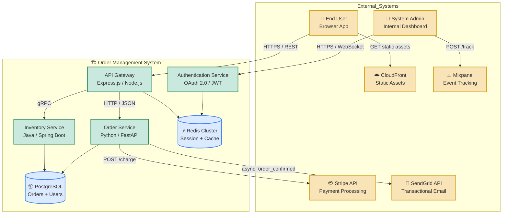
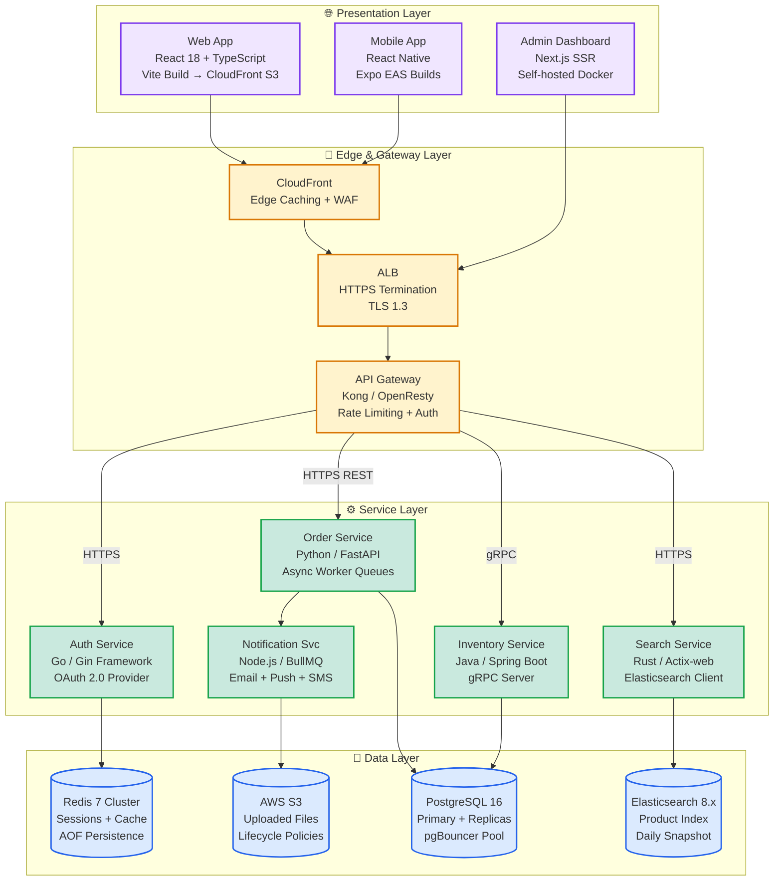
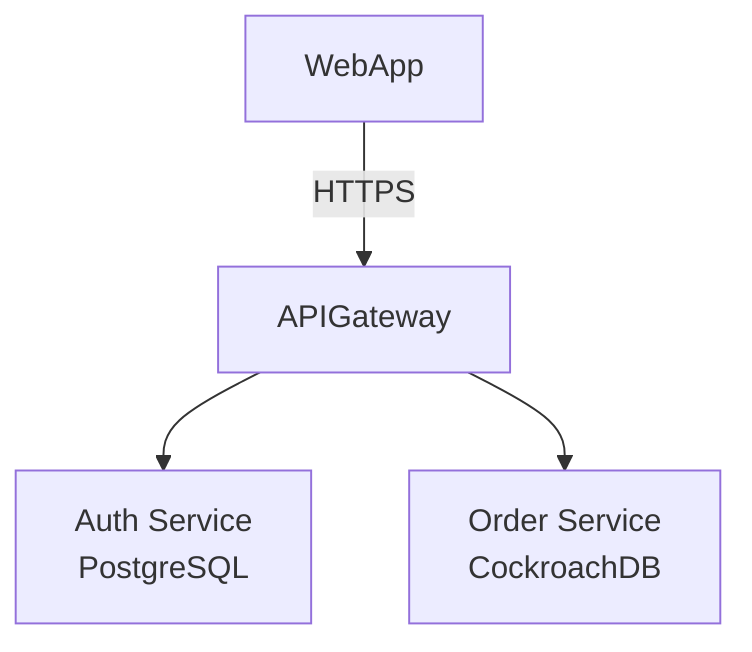

---


name: architecture-documentation-practices
description: Implements architecture documentation standards including Architecture Decision Records (ADRs), C4 model diagrams, and RFC templates to capture design rationale, system context, and component relationships.
license: MIT
compatibility: opencode
metadata:
  version: "1.0.0"
  domain: coding
  triggers: ADR, architecture decision record, C4 model, system context diagram, software architecture documentation, RFC template, design rationale, how do i document my architecture decisions
  archetypes:
    - orchestration
    - educational
  anti_triggers:
    - code implementation details
    - unit test writing
    - deployment scripts
  response_profile:
    verbosity: medium
    directive_strength: high
    abstraction_level: tactical
  role: implementation
  scope: implementation
  output-format: code
  content-types: [code, guidance, do-dont, examples]
  related-skills: architecture-decision-records, clean-architecture, domain-driven-design


---


# Architecture Documentation Practices

Documents system design decisions, context diagrams, and component relationships using standardized templates that keep documentation aligned with source code. When loaded, this skill makes the model act as a senior architect producing Architecture Decision Records (ADRs) with full rationale, creating C4 model diagrams at appropriate abstraction levels, and establishing review processes that prevent documentation rot. This skill treats documentation as living artifacts stored alongside code — not as a one-time exercise completed before development begins.

## TL;DR Checklist

- [ ] Choose the appropriate C4 diagram level: Context (Level 1) for system boundaries, Container (Level 2) for technology choices, Component (Level 3) for internal structure
- [ ] Write an ADR for every significant architectural decision using the Nygard template with Status, Context, Decision, and Consequences sections
- [ ] Use Mermaid or PlantUML syntax for diagrams embedded in Markdown — this keeps them version-controllable alongside source code
- [ ] Review new and updated ADRs in design meetings before they reach "Accepted" status to ensure team alignment
- [ ] Store ADR files in `/docs/architecture/ADR-NNNN-title.md` numbered sequentially and linked from a central index
- [ ] Add CI validation checks that verify diagrams render correctly and ADR files reference existing dependent records

---

## When to Use

Use this skill when:

- Making a significant technology selection decision (database choice, messaging framework, deployment target) that will affect the team's long-term development experience
- Documenting system boundaries for new services or integrations so onboarding engineers understand how their component fits into the broader architecture
- Creating an audit trail of why specific architectural choices were made — future developers need to understand context when modifying or extending systems
- Aligning multiple teams on shared interfaces, data ownership boundaries, and communication protocols across service boundaries
- Preparing for compliance or security reviews that require documented rationale for infrastructure and data handling decisions
- Onboarding new engineers who need an architectural overview without reading through years of commit history to reconstruct design decisions

---

## When NOT to Use

Avoid applying this skill for:

- **Code implementation details** — ADRs capture the "why" behind a decision, not the "how." Implementation specifics belong in inline code comments and function documentation, not architecture records
- **Unit test writing** — testing strategy and test cases are engineering artifacts documented alongside code. Use `testing-unit-integration-e2e` for test design patterns instead
- **Deployment scripts or infrastructure-as-code** — CI/CD pipeline configurations, Kubernetes manifests, and Terraform modules are executable artifacts. Document their purpose in an ADR if the tool selection itself was a significant decision, but don't document every configuration parameter
- **Routine operational procedures** — runbooks, incident response playbooks, and monitoring alert configurations belong in an operations documentation system, not architecture records

---

## Core Workflow

1. **Determine Diagram Scope and C4 Level** — Start at the highest level that provides value: Context (Level 1) for showing how the system relates to external systems and users, then drill down to Container (Level 2) if technology choices need justification, or Component (Level 3) if internal module boundaries require documentation. Never create a C4 diagram deeper than needed — a Component-level diagram with 50+ nodes becomes unmaintainable. **Checkpoint:** Ask "What decision does this diagram support?" If the answer is "none of the above," the diagram level is wrong. Each diagram must serve a specific documentation purpose.

2. **Create the System Context Diagram** — Document all external systems, users, and integrations that interact with your system using Mermaid `graph TD` or PlantUML C4 Container syntax. Include data flow directions (→ for outbound, ← for inbound, ↔ for bidirectional) and label each connection with the protocol or data format used (REST/JSON, gRPC, AMQP, S3 event). **Checkpoint:** The context diagram must be completable on a single screen without scrolling — if it doesn't fit on one monitor, you have too many systems. Group related external systems into aggregate boundaries if needed.

3. **Write Architecture Decision Records for Significant Choices** — Use the Michael Nygard template: Title (concise description), Status (Proposed/Accepted/Deprecated/Superseded), Context (the problem being solved and constraints), Decision (what was chosen), Consequences (trade-offs, benefits, and costs). Write ADRs before implementation begins so the team reviews the decision in context. **Checkpoint:** Every ADR must have a "Consequences" section that explicitly lists both positive outcomes and trade-offs accepted. If there are no downsides to consider, the decision hasn't been critically evaluated.

4. **Create Container-Level Diagrams** — For systems with multiple technology stacks, document each container (web application, API server, database, message queue, cache layer) with its runtime technology, language, and communication protocols. Use Mermaid class diagrams or C4 PlantUML extensions to show relationships between containers. **Checkpoint:** Each container should be representable on one slide of a presentation. If you need five slides for the container diagram, split it into subsystem views.

5. **Document Component Interactions with Sequence Diagrams** — For critical user flows (e.g., "user creates an order"), create Mermaid `sequenceDiagram` diagrams showing the interaction between components: API Gateway → Order Service → Payment Service → Database → Notification Service. Include error paths and timeout handling where relevant. **Checkpoint:** The sequence diagram must include both the happy path and at least one failure path (e.g., payment service timeout, database connection pool exhaustion).

6. **Store and Maintain Documentation Alongside Code** — Place ADR files in `docs/architecture/ADR-NNNN-title.md` with sequential numbering and a central index at `docs/architecture/README.md`. Store diagram source files as `.mmd` (Mermaid) or `.puml` (PlantUML) files alongside the code they document. Add a CI check that renders diagrams to verify they produce valid output. **Checkpoint:** The architecture documentation directory must be included in the repository root's `.gitignore` exclusions only for generated diagram images — source files (.mmd, .puml, .md) must always be version-controlled.

---

## Implementation Patterns

### Pattern 1: Architecture Decision Record (ADR) with Filled Example

A complete ADR following the Nygard template for a real technology selection decision, showing all required sections with substantive content. This is not a blank template — it demonstrates how each section should be filled with concrete rationale.

```markdown
<!-- docs/architecture/ADR-0015-database-selection.md -->
---
id: ADR-0015
title: Use PostgreSQL with TimescaleDB for Time-Series Data Storage
status: Accepted
date: 2024-08-12
deciders: platform-team, data-engineering, security-team
consulted: frontend-team (API contract impact), ops-team (monitoring)
---

## Context

The monitoring pipeline currently stores metric data in MongoDB using a document-per-metric collection pattern. As the number of monitored services grew from 12 to 87, query performance degraded: aggregation queries that joined metrics across multiple services now take 15-45 seconds for 24-hour windows. The frontend team reports that dashboard load times exceeding 3 seconds trigger user complaints in Slack daily.

Constraints:
- Data retention must support 90 days of high-resolution data (1-minute granularity) plus 7 years of daily aggregates
- The existing Grafana dashboards query using PromQL-like time-series syntax
- The team has PostgreSQL expertise but zero TimescaleDB production experience
- Budget allows for managed service or self-hosted; no preference either way

## Decision

Adopt PostgreSQL with the TimescaleDB extension for time-series metric storage. Migrate existing MongoDB collections to hypertable partitions on a daily interval. Use pg_partman for automated partition management of historical aggregates.

## Consequences

### Positive
- Query performance for time-window aggregations improves from 15-45s to under 200ms due to TimescaleDB's chunk-based compression and native time-partition pruning
- Single technology stack reduces operational complexity — one database to manage, monitor, and back up instead of MongoDB + Prometheus + InfluxDB
- PostgreSQL ecosystem (pgBouncer, Patroni, pgBackRest) is well-understood by the ops team
- SQL compatibility means existing BI tools (Metabase, Superset) can query metrics directly without a translation layer

### Negative / Trade-offs
- Team has no TimescaleDB production experience — allocate 2 weeks of spike work to understand hypertable tuning, chunk sizing, and compression policies before migration
- Migration from MongoDB requires building an ETL pipeline that converts document-per-metric to row-per-metric, which adds 3 weeks to the project timeline
- TimescaleDB licensed under Apache 2.0 but with additional restrictions on SaaS redistribution — verify legal compliance if metrics data is ever exposed to external customers (currently internal-only)
- Losing MongoDB's flexible schema means any new metric types must be added via ALTER TABLE, which requires coordination and migration scripts for existing deployments

### Acceptance Criteria
- [ ] P95 query latency for 24-hour window aggregations < 500ms on production data volumes
- [ ] Data retention pipeline successfully compresses chunks older than 7 days using raw_compressed policy
- [ ] ETL pipeline migrates all historical MongoDB metrics (6 months) with zero data loss verified by row count reconciliation
- [ ] Team completes TimescaleDB hands-on lab and documents operational runbook before production deployment
```

### Pattern 2: C4 System Context Diagram in Mermaid

Complete system context diagram showing user roles, the core application system, external service integrations, and data flow labels. This uses Mermaid `graph TD` syntax which renders directly in GitHub and GitLab Markdown.



### Pattern 3: C4 Container and Component Diagrams

Layered diagram showing the full technology stack from web frontend through API gateway to microservices and data stores. Uses Mermaid's nested subgraph syntax to represent architectural layers.



---

### Pattern 4: ADR Quality — Bad vs Good Examples

A quick reference showing common anti-patterns in architecture documentation versus the correct approach.

```markdown
# ❌ BAD: Vague ADR with no rationale — useless to future engineers
## Title: Use React
## Status: Accepted

We decided to use React for the frontend.

# Problems: No context, no alternatives considered, no consequences documented.
# An engineer reading this 6 months later has zero understanding of WHY React was chosen
# or what other options were on the table.

# ✅ GOOD: ADR with full rationale — answers "why" and "what if we need to change"
## Title: Use React for Frontend Application
## Status: Accepted

### Context
The team needs a frontend framework that supports component-based architecture, strong TypeScript integration, and active community support. Requirements include SSR for SEO (marketing pages), hydration for interactive admin panels, and the ability to ship incrementally without full rewrites.

### Alternatives Considered
- Vue.js: Strong community but smaller talent pool; less aggressive SSR roadmap
- Svelte: Excellent DX but limited SSR ecosystem at time of decision
- Angular: Full framework but heavier bundle size and steeper learning curve

### Decision
Adopt React 18 with Next.js for server-side rendering. Provides the component model, TypeScript support, and mature SSR toolchain.

### Consequences
+ Fast developer onboarding — most candidates have React experience
+ Next.js App Router supports incremental adoption of server components
- Larger initial bundle (~45KB gzipped baseline) requires code-splitting strategy
- React ecosystem moves quickly — need to budget quarterly time for framework upgrades
```

```markdown
# ❌ BAD: Diagram stored as a static image in Confluence
# The PNG file is 2 years old, the database changed from PostgreSQL to CockroachDB,
# and no one has updated the diagram because "it's just a picture."

# ✅ GOOD: Mermaid diagram embedded in ADR alongside the decision

# This diagram updates when the markdown file is committed — git diff shows exactly
# what changed, and CI validates it renders correctly before merging.
```

---

## Constraints

### MUST DO

- Capture the "why" not just the "what" in ADRs — every Decision section must be preceded by a thorough Context section that explains the problem being solved, constraints under which the team operates, and alternatives that were considered. An ADR that only describes what was chosen without explaining why is useless to future engineers
- Number ADRs sequentially in a central index at `docs/architecture/README.md` with columns for ID, Title, Status, Date, and Related Records. This index serves as the navigation surface for all architecture decisions in the repository
- Link related ADRs together using cross-references — if ADR-0015 (database selection) references ADR-0003 (API versioning strategy), include `Related: [ADR-0003](./ADR-0003-api-versioning.md)` in the frontmatter so reviewers can follow the decision chain
- Keep diagrams synchronized with code via CI validation checks — add a GitHub Actions or CI pipeline step that runs `mmdc` (Mermaid CLI) or PlantUML JAR to verify all `.mmd` and `.puml` files render without errors. Broken diagrams erode trust in the documentation system faster than no diagrams at all
- Use markdown-native diagram tools (Mermaid or PlantUML with Mermaid output mode) for version control compatibility — these tools produce plain-text diagram definitions that diff cleanly in git, enabling code-review-level scrutiny of architectural changes

### MUST NOT DO

- Write architecture documentation as a one-time exercise before development begins — ADRs and diagrams must be updated when the system evolves. An outdated ADR with "Accepted" status for a decision that was superseded 6 months ago is worse than no ADR at all because it actively misleads readers
- Store documentation in separate wikis disconnected from the codebase — if architecture docs live in Confluence or Notion while the code lives in GitHub, they will diverge within weeks. Always store ADRs and diagram source files alongside source code in the same repository
- Create diagrams that are too detailed to maintain — avoid drawing every method signature, class relationship, or database table column in C4 Component diagrams. A component diagram with more than 20 nodes is a sign you need to split into subsystem views at a higher abstraction level
- Leave ADRs with "Proposed" status indefinitely without moving them to "Accepted" or "Deprecated" — every proposed decision must be reviewed within one sprint cycle. Unreviewed proposals create ambiguity about whether a decision has team consensus or is still under discussion

---

## Live References

- [Architecture Decision Records (Michael Nygard Template)](https://cognitect.com/blog/2011/11/15/documenting-architecture-decisions) — Original ADR blog post by Michael Nygard introducing the lightweight documentation format
- [C4 Model for Software Architecture](https://c4model.com/) — Simon Brown's C4 model (Context, Containers, Components, Code) with interactive diagrams and PlantUML support
- [Mermaid.js Documentation](https://mermaid.js.org/intro/) — JavaScript-based diagramming toolkit that renders in GitHub, GitLab, and most Markdown viewers natively
- [PlantUML C4 Extension](https://github.com/plantuml-stdlib/C4-PlantUML) — Official PlantUML library for C4 model diagrams with container, component, and deployment layouts
- [ADR Index Template (ADR-Kit)](https://adr.github.io/) — Collection of community-contributed ADR templates organized by category from infrastructure to code architecture
- [Diagrams as Code Best Practices](https://cognitect.com/blog/2022/3/14/architecture-as-code) — Guidelines for keeping diagrams version-controlled and reviewable alongside source code

---

## Related Skills

| Skill | Purpose |
|---|---|
| `architecture-decision-records` | Comprehensive ADR lifecycle management including status workflows, governance processes, and automated validation of ADR format compliance |
| `clean-architecture` | Layered architecture patterns with dependency rule enforcement, boundary definitions, and testability guarantees for maintainable systems |
| `domain-driven-design` | Bounded context mapping, aggregate design, event sourcing patterns, and tactical DDD techniques for complex business domains |
