---


name: mermaid-diagrams
description: Creates clear, web-savvy MermaidJS diagrams (flowcharts, sequence diagrams,
  Gantt charts, and more) for Markdown documentation that renders beautifully on GitHub.
license: MIT
compatibility: opencode
metadata:
  version: "1.0.0"
  domain: writing
  triggers: mermaid, mermaidjs, diagram, flowchart, sequence diagram, how do i create a diagram, github markdown diagram, architecture diagram a diagram
  archetypes:
  - educational
  anti_triggers:
  - brainstorming
  - vague ideation
  response_profile:
    verbosity: medium
    directive_strength: low
    abstraction_level: strategic
  role: reference
  scope: implementation
  output-format: report
  related-skills: technical-documentation


---


# MermaidJS Diagramming for GitHub Markdown

Teaches AI models to write clean, well-structured MermaidJS diagrams that render beautifully on GitHub's native Markdown viewer. Covers diagram type selection, syntax best practices, GitHub-specific constraints, and common pitfalls across 10+ diagram types — flowcharts, sequence diagrams, Gantt charts, mindmaps, and more.

## TL;DR Checklist

- [ ] Prefer `flowchart` over `graph` — `graph` is deprecated in Mermaid
- [ ] Keep diagrams under 20–25 nodes for readability on GitHub
- [ ] Use ASCII-safe characters only — no Unicode arrows (`→`), em dashes (`—`), or smart quotes
- [ ] Use `<br/>` (not `\n`) for line breaks inside node labels
- [ ] Label edges with transition descriptions — don't assume flow is obvious
- [ ] Use subgraphs to group related nodes when exceeding 10–15 nodes
- [ ] Put diagram-defining config in a YAML `---` frontmatter block at the top
- [ ] Use ` ```mermaid` (lowercase) code fence — uppercase `Mermaid` won't render on GitHub
- [ ] Test every diagram in the [Mermaid Live Editor](https://mermaid.live) before committing
- [ ] Add text descriptions around diagrams for accessibility and context

---

## When to Use

Use this skill when:

- Writing architecture documentation that needs a system diagram showing how components interact
- Creating a README with a CI/CD pipeline flowchart, data flow diagram, or project structure overview
- Documenting a sequence of API calls, message exchanges, or protocol interactions in an issue or PR
- Building project timelines or roadmaps with Gantt charts in project Wikis
- Adding version control history visualizations with Git graphs in changelogs or release notes
- Explaining entity relationships (ER diagrams) or class hierarchies in design documents
- Visualizing user journeys or state machines for feature documentation
- Creating mindmaps or timeline diagrams for technical proposals or ADRs

## When NOT to Use

Avoid this skill for:

- Complex UML class diagrams with 30+ classes and dense relationships — Mermaid's class diagram support is limited; use PlantUML or a dedicated UML tool instead
- Pixel-perfect diagrams where exact spacing, font sizes, or alignment matter — Mermaid uses auto-layout and you cannot fine-tune positions
- Diagrams that need interactivity (click events, tooltips, zoom/pan) — GitHub strips all interactive features; use a standalone Mermaid renderer or an image-based alternative
- Diagrams over ~50KB in source size — GitHub may fail to render large blocks
- Color-coded diagrams where meaning depends on hue alone — GitHub's dark/light mode may invert or reduce contrast; add text labels as a backup

---

## Core Workflow

1. **Choose the Right Diagram Type** — Match the concept you're visualizing to the correct Mermaid diagram type:
   - Processes, pipelines, decision trees → `flowchart`
   - API calls, message passing, time-ordered interactions → `sequenceDiagram`
   - State machines, UI flow → `stateDiagram-v2`
   - Class hierarchies, data models → `classDiagram`
   - Entity relationships → `erDiagram`
   - Project timelines, schedules → `gantt`
   - Git branches, merges, history → `gitGraph`
   - Hierarchical ideas, brainstorming → `mindmap`
   - Chronological events → `timeline`
   - Quadrant-based analysis (SWOT, priority) → `quadrantChart`
   - Software architecture (C4 model) → `C4Context`, `C4Container`, `C4Component`
   - Proportions, shares → `pie`
   - User goals and steps → `journey`
   - Technical requirements traceability → `requirementDiagram`
   - Flow/category relationships → `block`
   - Data flow between categories → `sankey`
   - X-Y data plotting → `xyChart`

   **Checkpoint:** If you can describe your diagram in one sentence as "X shows how Y does Z" the type is probably right. If you need three sentences, split into two diagrams.

2. **Plan the Layout Direction** — Choose the layout that matches your narrative flow:
   - **TD (top-down)** — Hierarchies, sequential processes, decision trees, anything with 3+ layers. Readers scan top-to-bottom naturally.
   - **LR (left-right)** — Timelines, simple pipelines (2–4 stages), before/after comparisons, horizontal flows. Easier to read for wide-but-shallow structures.
   - **Direction per subgraph** — Use `direction TB` or `direction LR` inside subgraphs to mix layouts for complex diagrams.

   **Checkpoint:** If your diagram has more vertical depth than horizontal width, use TD. If it's wider than tall, use LR.

3. **Structure Nodes with Descriptive IDs** — Use meaningful, CamelCase IDs that document themselves:
   ```mermaid
   %% ✅ GOOD — IDs describe the component
   flowchart TD
     AuthService --> Database
     AuthService --> CacheLayer

   %% ❌ BAD — IDs are meaningless
   flowchart TD
     A1 --> B2
     A1 --> C3
   ```
   - Use `%%` comments to document parts of the diagram for future maintainers
   - Keep labels under ~25 characters when possible; use `<br/>` for longer text
   - Use the same ID style (PascalCase, camelCase, or kebab-case) consistently within a document

4. **Add Edge Labels for Clarity** — Every edge that represents a meaningful transition gets a label:
   ```mermaid
   flowchart LR
     Client -- "sends request" --> API
     API -- "validates token" --> Auth
     API -- "queries data" --> Database
   ```
   - Label syntax: `-- "label text" -->` or `--|label text|-->` for short labels
   - Without labels, readers must guess why edges exist — label non-obvious transitions
   - Edge labels should be short phrases (under 30 characters) when possible

5. **Test in the Mermaid Live Editor** — Before committing, paste the entire block into [mermaid.live](https://mermaid.live):
   - Verify the diagram renders without errors
   - Check that long labels don't overflow nodes
   - Confirm layout direction produces a readable arrangement
   - Toggle GitHub's light/dark mode (via browser dev tools) to verify contrast works in both
   - If the diagram fails to render, check for: Unicode characters, missing subgraph `end` keywords, unmatched quotes, or IDs with spaces

---

## Diagram Type Reference

| Type | Best Use Case | GitHub Notes | Example |
|------|--------------|--------------|---------|
| `flowchart` | Processes, pipelines, decision trees, architecture flows | Most common type; `flowchart` preferred over deprecated `graph` | CI/CD pipeline with build → test → deploy stages |
| `sequenceDiagram` | API calls, time-ordered interactions, message passing | Auto-numbers participants; use `actor` for human roles | Client → Auth server → API → Database request flow |
| `classDiagram` | Data models, class hierarchies, interface contracts | Limited to ~15 classes before layout gets crowded | User, Order, Product with relationships and cardinality |
| `stateDiagram-v2` | State machines, UI workflows, lifecycle management | Use `[*]` for start/end states | Order lifecycle: Created → Paid → Shipped → Delivered |
| `erDiagram` | Entity-relationship models, database schemas | Supports cardinality notation; keep under 10 entities | Customers, Orders, Products with `||--o{` relationships |
| `gantt` | Project timelines, schedules, release planning | Date format: `YYYY-MM-DD`; use `crit` for critical path | Sprint timeline with epics, tasks, and milestones |
| `pie` | Proportions, market share, resource allocation | Simple format; titles shown as legend | Language usage: 60% TypeScript, 25% Python, 15% Go |
| `gitGraph` | Branch strategies, merge workflows, release history | Branches auto-order by first commit; use `cherry-pick` | Feature branch → develop → main with release tags |
| `mindmap` | Brainstorming, knowledge hierarchies, outlines | Indentation-driven syntax; no edge labels | Project architecture with backend, frontend, infra branches |
| `timeline` | Chronological events, roadmaps, histories | Sections group related events; limited styling | Product roadmap: Q1 MVP → Q2 Beta → Q3 GA |
| `quadrantChart` | Prioritization matrices, SWOT analysis, portfolio | Points positioned by X/Y values (0–1 range); quadrant labels in config | Feature priority: effort vs impact |
| `C4Context` | System context diagrams (C4 model) | Uses `Person` and `System` boundaries; good for high-level architecture | User → System A → System B interactions |
| `block` | Category-based flow diagrams | Columns group related blocks; simple structure | Tech stack: Languages, Frameworks, Tools in columns |
| `journey` | User experience flows, task completion steps | Auto-scales; tasks listed in order with scores | User onboarding: signup → verify → dashboard |

---

## GitHub Rendering Guide

### Code Fence

Use **lowercase** ` ```mermaid ` — GitHub only renders lowercase. Uppercase ` ```Mermaid ` or ` ```mmd ` will not render.

```markdown
<!-- ✅ WORKS on GitHub -->


<!-- ❌ DOES NOT WORK on GitHub -->
```Mermaid
flowchart TD
  A --> B
```
```

### Feature Restrictions

GitHub's native Mermaid renderer removes or ignores certain features. Know these limitations before you write:

| Feature | GitHub Support | Workaround |
|---------|---------------|------------|
| Click events (`click A callback`) | ❌ Stripped | Add text links outside the diagram instead |
| Tooltips (title attribute on nodes) | ❌ Stripped | Add explanation in surrounding prose |
| Theme config via `%%{init:...}` | ⚠️ Config ignored | GitHub uses system light/dark mode; test both |
| `fontSize`, `fontFamily` in config | ⚠️ Partially respected | Keep labels short — default font is always readable |
| Markdown strings (`"..."`) | ✅ Supported | Use for bold/italic/`code` in labels |
| Subgraph styling | ✅ Supported | Use `style` or `classDef` for consistent coloring |

### Size Limit

Diagrams over approximately **50KB** in source text may fail to render on GitHub. As a rule of thumb:
- Keep diagrams under 20–25 nodes
- Keep labels under ~25 characters when possible
- If you need more nodes, split into multiple smaller diagrams that each cover one concept
- Diagrams over 50KB are silently dropped — you get no error message

### Theme Adaptation

GitHub renders Mermaid in the **viewer's system theme** (light or dark mode). You cannot force a specific theme. Design diagrams that work in both:
- Do **not** rely on color alone to convey meaning — always add text labels or patterns
- Use high-contrast combinations (dark text on light backgrounds, light text on dark backgrounds)
- Test in both modes by toggling your OS/browser theme before pushing

### Testing Protocol

Before committing any Mermaid diagram:

1. Paste the full code block into [mermaid.live](https://mermaid.live) — fix any parse errors
2. Copy the rendered output as a PNG and verify it reads well at a glance
3. Toggle your system theme and re-check contrast
4. If the diagram is complex, ask a colleague to describe what they see in 1–2 sentences — if they can't, simplify

---

## Syntax Reference

### Node Shapes

| Shape | Syntax | Example |
|-------|--------|---------|
| Default rectangle | `id[label]` | `Server[Web Server]` |
| Rounded rectangle | `id(label)` | `API(API Gateway)` |
| Stadium (pill shape) | `id([label])` | `Start([Begin Process])` |
| Rhombus (decision) | `id{label}` | `Auth{Is Valid?}` |
| Parallelogram | `id[\\label\\]` | `Input[\\Parse Data\\]` |
| Trapezoid | `id[/label\\]` | `Service[/Transform\\]` |
| Double circle | `id(((label)))` | `End(((System Halt)))` |
| Asymmetric | `id>label]` | `Output>Result]` |
| Hexagon | `id{{label}}` | `Routing{{Load Balance}}` |

### Edge Styles

| Style | Syntax | Use Case |
|-------|--------|----------|
| Solid arrow | `-->` | Default flow, data passing |
| Thick arrow | `==>` | Primary/critical path |
| Dotted arrow | `-.->` | Optional/monitoring/async flow |
| Open circle | `--o` | UML aggregation or "uses" |
| Cross | `--x` | Error path, termination |
| Bidirectional | `<-->` | Two-way communication |
| Label (inline) | `-- "text" -->` | Standard edge labels |
| Label (short) | `--\|text\|-->` | Compact labels |

### Subgraph Structure

Wrap related nodes in a `subgraph` block with an optional `direction` override:

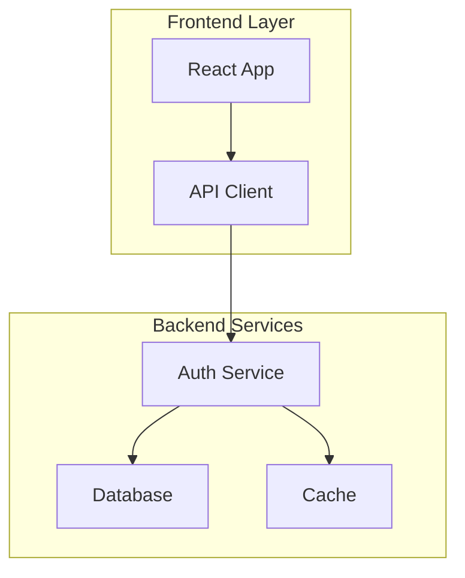

Rules:
- Every `subgraph` needs a closing `end` keyword — forgetting `end` is the most common Mermaid syntax error
- Use `subgraph Name["Display Name"]` if the display name differs from the ID or contains special characters
- Direction override (`direction TB/LR`) is optional — without it, the subgraph inherits the parent's direction

### Comments

Use `%%` for single-line comments. Comments are ignored by the renderer but visible in source:

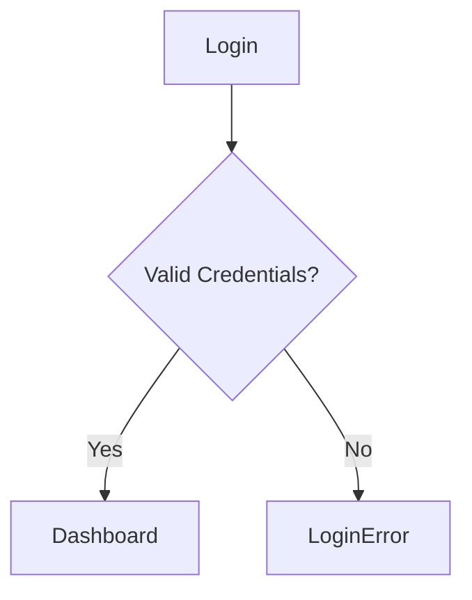

### Styling with classDef and style

Apply CSS-like classes to nodes for consistent visual grouping:

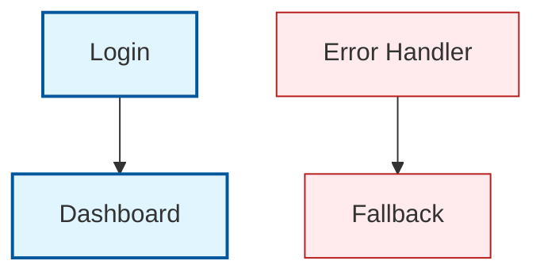

Alternatively, use inline `style` for one-off nodes:

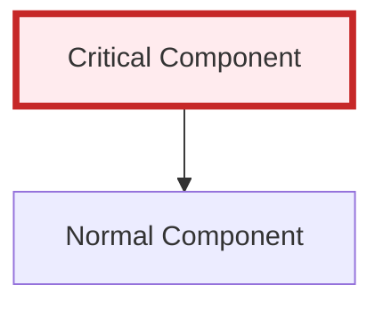

### Markdown Strings for Rich Labels

Use double-quoted markdown strings to include **bold**, *italic*, or `code` formatting in node labels:

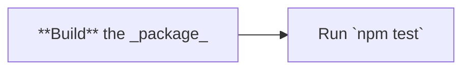

Supported formatting inside markdown strings: `**bold**`, `*italic*`, `` `code` ``.
Line breaks inside markdown strings: use `<br/>` not `\n`.

### Diagram Configuration (YAML Frontmatter)

Set global rendering options with a YAML block at the top of the diagram:

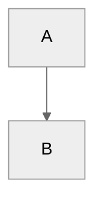

Available themes: `default`, `forest`, `dark`, `neutral`, `base`.
Use `base` as a starting point for custom themes with `themeVariables`.

---

## Implementation Patterns

### Pattern 1: Deployment Pipeline Flowchart

A top-down flowchart showing a CI/CD deployment pipeline with subgraphs for each stage. Uses TD direction for the natural reading flow from commit to production.

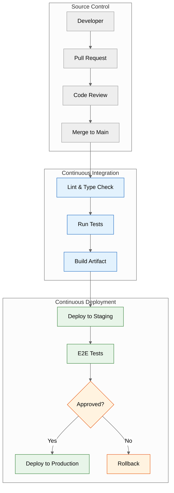

**Key design choices:**
- Three subgraphs create visual separation between source control, CI, and CD stages
- `direction LR` in Source keeps the PR flow compact horizontally
- A decision rhombus (`Approve`) marks the manual gating step
- Color classes distinguish CI (blue), CD (green), and gates (orange)
- Edge labels on the gating paths explain the two outcomes

### Pattern 2: API Interaction Sequence Diagram

A sequence diagram showing how a client, auth service, API gateway, and database interact during a token-based request. Reads left-to-right as time progresses downward.

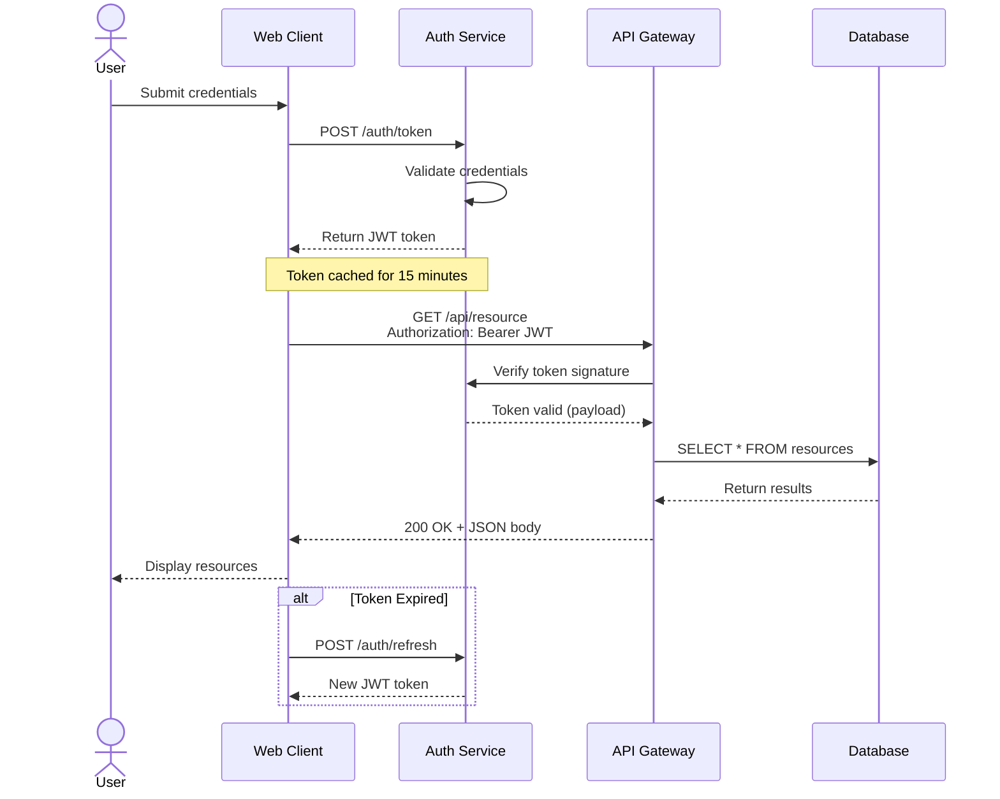

**Key design choices:**
- `actor User` distinguishes the human role from system participants
- Dotted lines (`-->>`) for responses, solid lines (`->>`) for requests — standard convention
- `Note over` documents the token caching behavior inline
- `<br/>` in the API request label keeps the readable content on one line
- `alt` block handles the token refresh edge case without cluttering the main flow

### Pattern 3: Before/After Comparison

Two subgraphs side by side (LR direction) comparing a naive architecture against an improved one. Useful for RFCs, ADRs, or refactoring proposals.

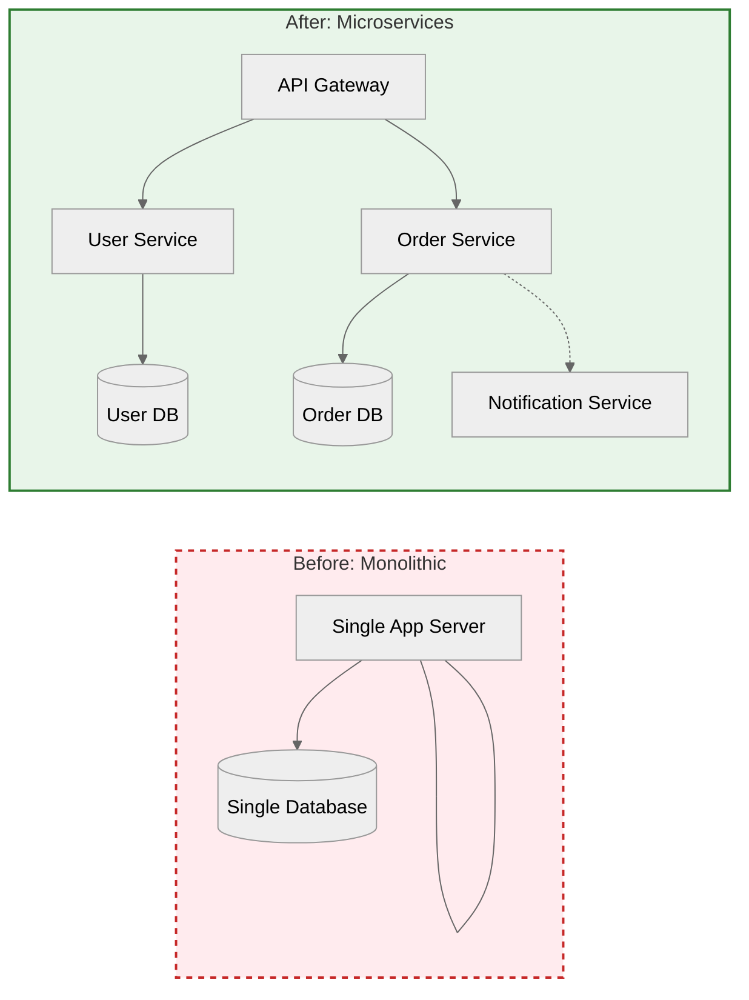

**Key design choices:**
- LR layout places both architectures side by side for easy visual comparison
- Red dashed border on "Before" signals it's the problem state; green solid on "After" signals improvement
- The microservices subgraph uses the same general structure but adds new services
- Dotted edge from Orders to Notify indicates an async/eventual interaction
- Restrained node count (6 in After) keeps the comparison readable

### Pattern 4: Composition Diagram with Mixed Layout

A complex architecture diagram that combines TD and LR directions in nested subgraphs. Shows how direction directives can create readable multi-region layouts.

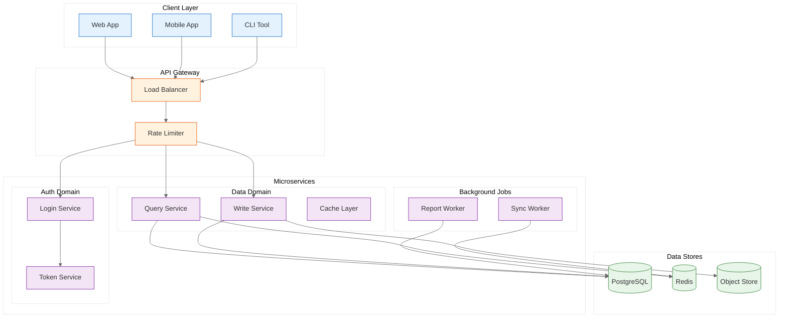

**Key design choices:**
- Outer TB layout stacks the four main layers vertically (clients → gateway → services → storage)
- LR direction inside `ClientLayer` and `Storage` keeps those layers horizontally compact
- Nested subgraphs inside `Services` group domains without creating a new top-level layer
- Four color classes distinguish client, gateway, domain, and storage roles
- Config uses `base` theme with custom `themeVariables` for a neutral, professional look

---

## Constraints

### MUST DO

- **Use `flowchart` over `graph`** — `graph` is deprecated. All new diagrams should use `flowchart`.
- **Use ASCII-safe characters only** — Smart quotes (`""`), em dashes (`—`), en dashes (`–`), Unicode arrows (`→`, `↔`, `⇒`), and non-ASCII punctuation break Mermaid's parser. Use straight quotes (`""`), hyphens (`-`), and ASCII arrows (`-->`, `<-->`, `==>`) instead.
- **Use `<br/>` for line breaks** — Actual newlines inside quoted node labels or edge labels may produce parse errors.
- **Add edge labels for non-obvious transitions** — If the reader has to guess why an edge exists, it needs a label.
- **Test every diagram in the Mermaid Live Editor** — Always paste the raw Mermaid source into [mermaid.live](https://mermaid.live) and verify it renders before committing.
- **Add text descriptions around diagrams** — Include a sentence explaining what the diagram shows, so the page is meaningful if the diagram fails to render or for screen reader users. Use this as alt-text equivalent.
- **Keep labels short** — Under ~25 characters when possible. Use `<br/>` for longer labels.
- **Prefer multiple small diagrams** — One focused diagram per concept is better than one crowded diagram with 40 nodes.

### MUST NOT DO

- **Do NOT use Unicode arrows or special characters in labels or IDs** — Characters like `→`, `—`, `–`, `✓`, `✗` silently break Mermaid rendering. Use `-->`, `->`, `-`, `x`, `v` or simple ASCII alternatives.
- **Do NOT embed interactive features** — `click` callbacks, `tooltip` attributes, and `target` links are stripped by GitHub. Put links in the surrounding Markdown instead.
- **Do NOT create diagrams over ~50KB** — GitHub silently drops them with no error message. If you need more content, split into multiple diagrams.
- **Do NOT rely on color alone to convey meaning** — GitHub renders in both light and dark mode. Always add text labels, patterns, or icons as a backup for color distinctions.
- **Do NOT mix diagram types in a single code block** — Each ` ```mermaid ` block must contain exactly one diagram type. If you need a flowchart and a sequence diagram, use two separate blocks with separate descriptions.
- **Do NOT use `\n` for line breaks** — Mermaid expects `<br/>` for line breaks inside labels. The `\n` escape sequence is not supported inside quoted strings.
- **Do NOT use spaces or special characters in node IDs** — IDs like `[My Service]` or `[data:flow]` will fail. Use CamelCase instead: `MyService`, `DataFlow`.

---

## Output Template

When asked to create a Mermaid diagram, produce:

1. **Diagram Type & Purpose** — One sentence explaining what the diagram shows and why it's the right type for this content (e.g., "A TD flowchart showing the CI/CD pipeline from commit to production deployment.")

2. **Code Block** — The complete Mermaid diagram code inside a ` ```mermaid ` code fence. Include a `---` config block if theme or layout tweaks are needed.

3. **Legend / Key** — If using semantic colors, custom classes, or abbreviations in node IDs, include a brief legend explaining them. For simple diagrams, a one-sentence description suffices.

**Template:**

```markdown
<!-- Explanation -->
<!-- [Diagram Type] showing [what it represents] -->

```mermaid
[diagram code]
```

<!-- Legend -->
<!-- Colors/classes used: [explanation of each] -->
```

**Example:**

```markdown
A TD flowchart showing the user authentication flow from login request to dashboard access.

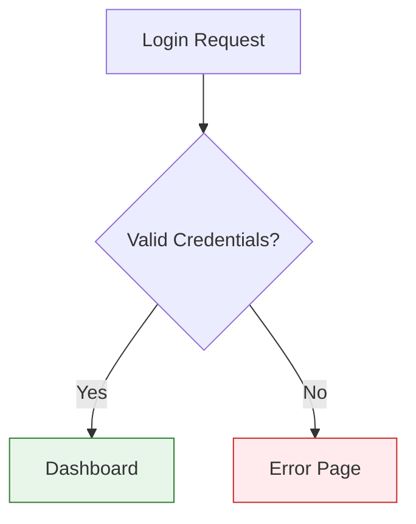

**Legend:** Green nodes represent success states, red nodes represent error states.
```

---

## Related Skills

| Skill | Purpose |
|-------|---------|
| `technical-documentation` | Writing the prose that surrounds and explains your Mermaid diagrams — READMEs, API docs, architecture overviews |
